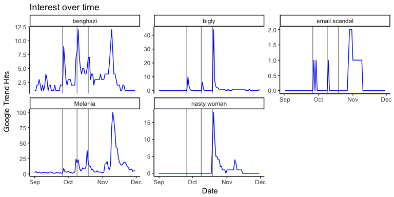
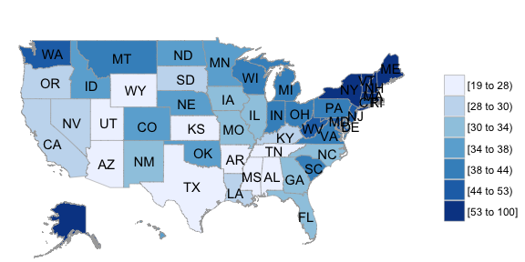
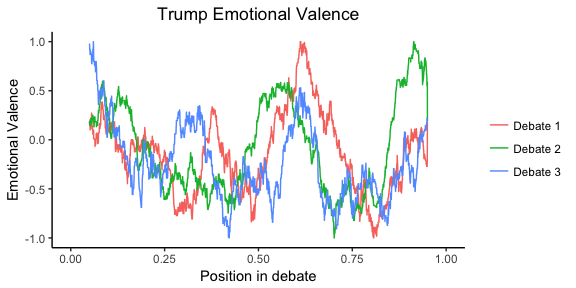
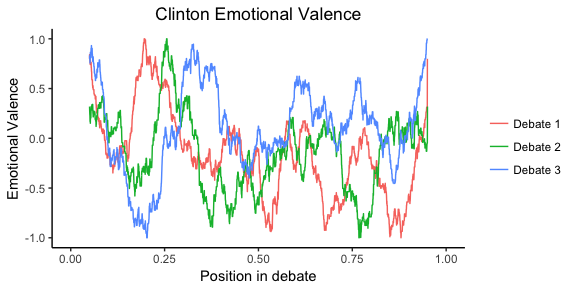
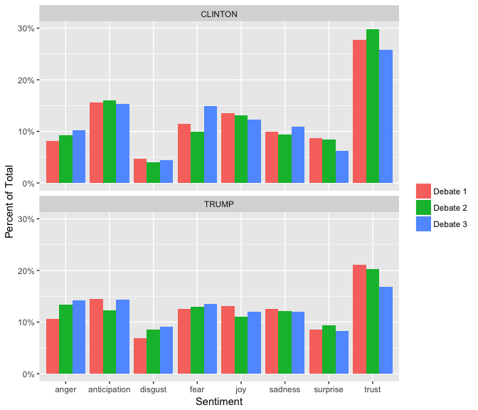

<!-- README.md is generated from README.Rmd. Please edit that file -->
The 2016 presidential debates unfolded slowly as November approached. We watched candidates battle to the bittersweet end trying to convince the American people that they were the better-suited candidate to lead our country. According to [CNN.com](http://money.cnn.com/2016/09/27/media/debate-ratings-record-viewershi%20p/), a record breaking 84 million viewers tuned in to watch Hillary Clinton and Donald Trump in the first debate, making this the most watched presidential debate in history. Though the first debate broke records, there were three debates in total spanning over two months. Some would consider these debates amusing (or surprising) to say the least, such that terminology never before used in political discussions was broadcasted live for United States citizens and other countries to see in all its glory. "Piggy" and "deplorable" were just a couple words that were said during the debates that fired up some viewers, and there was even some terminology used that was just plain confusing like "bigly." So what is it that we all do when we want to know more about something? We just "Google it" of course.

As each debate unfolded, we wondered how many other people (like us) were using Google to search for termininology used by Donald Trump and Hillary Clinton during the debates- like the second amendment for example. Thus, we generated an analysis utilizing debate content and Google search terms. We started checking out Google Trends and tried trending some search terms ourselves. Google Trends is available to the general public with the purpose of displaying global search trends in Google. Google Trends adjusts Google searches by dividing each individual data point by total searches, geography and time range. In other words, this displays the term that was searched in relation to global search-volume. Trends in the data can be graphed by country or city.

Terms such as “second amendment” and “Isis” were some of the first terms we tried that we thought would probably prompt some pretty drastic search trends, which they did. Then, after using Google Trends to search what was intended to be a few words, we ended up searching a copious amount of terms (related and unrelated to the debates)! It was time to get down to business and locate the debate scripts and take some terms used by our candidates for a spin in Google Trends.

We webscraped and read [each](http://www.presidency.ucsb.edu/debates.php) presidential debate script and noted some terminology that stood out. Displayed below are some terms used by our now President-Elect Donald Trump during the second debate. The terms *Melania*, *e-mail scandal*, *bigly*, *nasty woman*, and *benghazi* were some of the most searched words during and immediately following the second debate. "Bigly" was misinterpreted as the Donald Trump phrase, "Big League." Interestingly as a result of this confusion, Google Trends reported that "Bigly" had become the top trending search on all of Google. Check out the Tweet [here](http://www.aol.com/article/news/2016/10/19/1-word-most-searched-term-during-pres%20idential-debate/21587735/).

Here are some of the top words and phrases that had interesting search trends. After webscraping the three presidential debates, we broke down the debate into individual words said by each speaker (Donald Trump or Hillary Clinton). The following results were then generated using the R package Googletrendsr from CRAN, which displays the Google search trends for those specific words.

Additionally, we were interested in specific terminology searched in Google at the state level. Specifically, which states were Googling some terms more than others? The following graphic is categorized by state using Google Trends search term data and the choroplethrMaps package in R. This example displays the state-level search term data by state for "bigly".

Lets give some meaning as to how to interpret the scales shown in the gtrends plot from Google results as well as the choropleth map. The scale ranging from 0% to 100% and represents the percentage of searches for that word or pharase with respect to the total searches in that region. So for example, if the word "bigly", has a value of %50 on the plot that means that during the specified period of time it accounted for %50 percent of the total searches in Google.

We were also curious about the emotional context of each speaker during the three debates. Did one candidate speak in a more positive context than the other? We used the Syuzhet package from R to conduct this exploratory part of our analysis. Syuzhet is a package consisting of four sentiment dictionaries developed at Stanford. The purpose of this package is to extract words and assign them "sentiment" values from the sentiment dictionaries and plot them based on speaker. This package assigns words a sentiment score based on overall positivity and negativity. There is not a numerical limit on scores, though negative words will tend to have negative sentiment scores and positive words will have positive sentiment scores. As shown below, each speaker is plotted with respect to the first, second or third debate with normalized emotional valence scores. As you can see, both Clinton and Trump had a pretty broad range of emotions during each debate. From this exploratory analysis, we can report that one candidate seemed to speak in a more negative emotional context than the other. Can you see which?

This first plot displays the emotional valence of both candidates during each of the three debates, comparing one candidtate's emotional valence to the other. Emotional valence scores range from -1.0 to +1.0 and are assigned based on how negative or how positive a word is. For example, "ecstatic" would be rated a +1.0, whereas "horrible" would be rated a -1.0.

The following two plots display emotional valence per speaker across the three debates. These plots compare the speaker's individual emotional valence across the three debates. See any interesting trends or patterns?

Next, we plotted words based on the seven types of sentiment categories. Individual words are categorized based on sentiment and candidate. This plot displays the sentiment in Donald Trump's words for all three debates. The highest percentage of Trump's words all three debates fell into the category "trust."

Similarly, the other plot in this output displays the sentiment in Hillary Clinton's words for all three debates. Based solely on the plot, Clinton's anger, anticipation and sadness remained steady during the three debates, whereas fear fluctuated thrououghout the debates. It's interesting to see the candidates emotional patterns as the debates progress becasue some would argue this are political stragery emerging.

As with any research, there are some limitations to this analysis. The data is limited to people who use Google as their search engine. This would exclude non-internet users and people who use Yahoo or other search engines. Though this may seem like a daunting limitation, Google is the most popular search engine in the world fostering over 1.17 billion people. If you want to check out the statistics behind this, check out this [link](https://www.statista.com/chart/899/unique-users-of-search-%20engines-in-december-2012/).

Another limitation is the way that computers understand sentiment in individual words. Our analysis only used individual words, not sentences which are also used in this type of analysis. Computers do not have the ability to distinguish between words the same way that humans do, especially in terms of context. For example, "cool" could be interpreted in a couple different ways. It could be interpreted as relating to being cold, or it could be used as slang like "that's cool man." A computer can not detect sarcasm.

Now that you have seen how the candidates represented themselves by thier words, in a contextual analysis, presenting in a simplified format. You gotta ask yourself, are those the results you would have maybe guessed prior to reading this?
